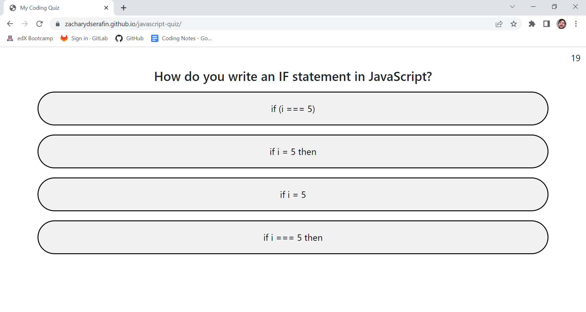

# University of Arizona Coding Boot Camp: Project Four - Quiz

*Challenge 04 - Utilizing skills we learned in "Module 4: Web APIs"*

## Description

The goal of Project (or Challenge) Four was to create our own JavaScript quiz web application. The quiz needed to be dynamic, randomized, timed, and user-friendly. In addition, the user would be left with their score at the end of the quiz, and they could insert their initials into a text box to save their score to a leaderboard. I also added a button to clear the user's previous scores and a button to take the user to the leaderboard from the start page.


## Screenshot



## Links

*Link to deployed webpage:* https://zacharydserafin.github.io/javascript-quiz/

*Link to GitHub repository:* https://github.com/zacharydserafin/javascript-quiz

## Credits

*Stack Overflow*: I referenced the following line of code from user "Barmar" at https://stackoverflow.com/a/52673026

This answer was pertaining to the question "JS: Multiple objects in an array stored in local storage" and the answer cited below was posted on Oct 5, 2018.

```
function addNewShow(titleArg, typeArg, genreArg, watchedArg) {
  // Get array from local storage, defaulting to empty array if it's not yet set
  var showList = JSON.parse(localStorage.getItem('showList') || "[]");

  var show = {
    title: titleArg,
    type: typeArg,
    genre: genreArg,
    watched: watchedArg
  };
  showList.push(show);
  localStorage.setItem("showList", JSON.stringify(showList));
};
```

*Stack Overflow*: I referenced the following line of code from user "0leg" at https://stackoverflow.com/a/50683952

This answer was pertaining to the question "Sort array of objects by string property value" and the answer cited below was posted on Jun 4, 2018.

```
var items = [
  { name: 'Edward', value: 21 },
  { name: 'Sharpe', value: 37 },
  { name: 'And', value: 45 },
  { name: 'The', value: -12 },
  { name: 'Magnetic', value: 13 },
  { name: 'Zeros', value: 37 }
];

// sort by value
items.sort(function (a, b) {
  return a.value - b.value;
});
```

*StackFame*: I referenced this site to learn how to use the Durstenfeld shuffle algorithm in my project.

https://stackfame.com/5-ways-to-shuffle-an-array-using-moder-javascript-es6

```
function shuffle(array) {
  for (let i = array.length - 1; i > 0; i--) {
    const j = Math.floor(Math.random() * (i + 1));
    [array[i], array[j]] = [array[j], array[i]];
  }
}

const shuffledArr = shuffle(array);
```
*w3schools*: I used questions pulled from this site to populate my quiz's questions.

https://www.w3schools.com/quiztest/quiztest.asp?qtest=JS
